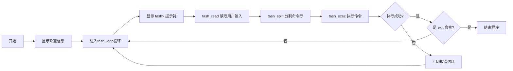
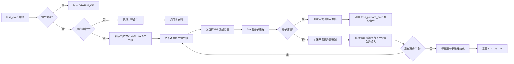
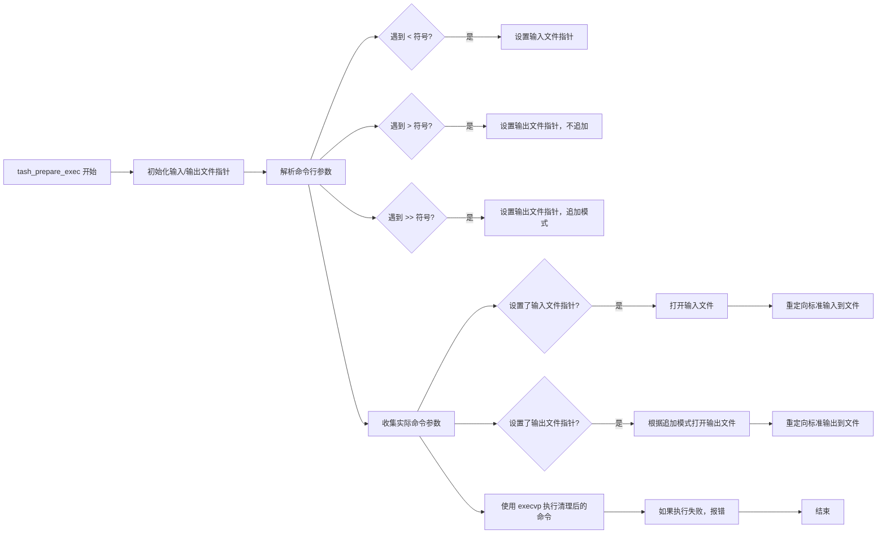
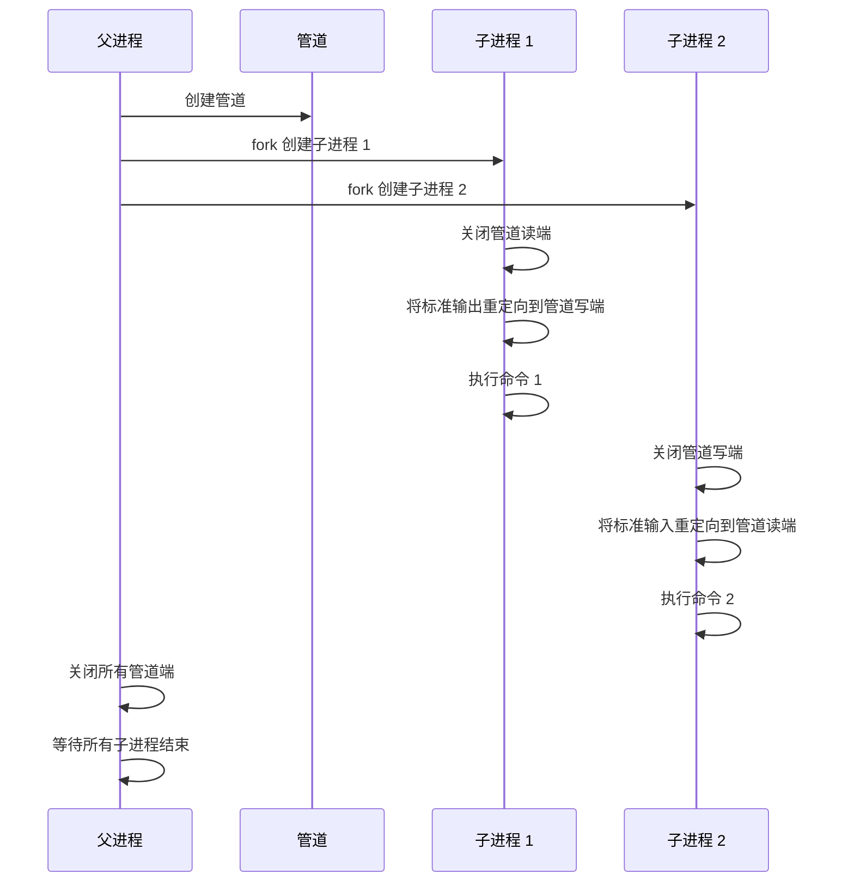
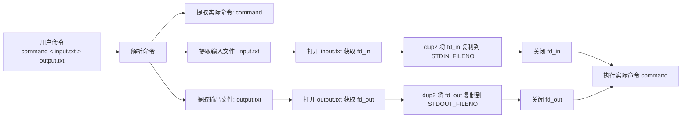

# TASH

TASH (TAngsongxiaoba SHell) 是一个用 C 语言实现的简单的 Unix Shell 程序。

主要功能包括：

1. 基本的 Shell 功能：读取用户输入、解析命令和执行命令。
2. 支持执行外部命令和内置命令（cd 和 exit）。
3. 支持标准 I/O 重定向：输入重定向 (<)、输出重定向 (>) 和追加输出重定向 (>>)。
4. 支持管道 (|)：可以将一个命令的输出作为另一个命令的输入。

## 工作流程

### 基本流程

### 管道处理流程

管道 ('|') 的处理在 `tash_exec` 中完成。

解析 `int tash_exec(char **args)` 对管道的处理：

1. **管道检测与分割**:
    - 初始化一个命令数组 `cmds`，第一个元素指向原始的 `args`。
    - 遍历 `args`，查找管道符 `|`。
    - 每当找到一个 `|`：
        - 将其替换为 `NULL`，从而将当前命令的参数列表截断。
        - 检查 `|` 后面是否有命令，或是否连续出现 `|`，若有则报语法错误。
        - 将 `|` 后的下一个参数地址存入 `cmds` 数组，作为下一个命令的开始。
2. **执行命令**:
    - 使用一个循环，遍历 `cmds` 数组中的每个命令。
    - `in_fd` 变量用于保存上一个命令的输出文件描述符（对于第一个命令是 `STDIN_FILENO`）。
    - **创建管道 (如果需要)**: 如果当前命令不是管道中的最后一个命令，则调用 `pipe()` 系统调用创建一个管道 `pipe_fds`。
    - **创建子进程**: 调用 `fork()` 系统调用创建一个子进程。 `pids[i]` 保存子进程ID。
    - 对于 **子进程 (`pids[i] == 0`)**:
        - **输入重定向**: 如果 `in_fd` 不是 `STDIN_FILENO`，则使用 `dup2(in_fd, STDIN_FILENO)` 将子进程的标准输入重定向到 `in_fd`。然后关闭 `in_fd`。
        - **输出重定向**: 如果当前命令不是最后一个命令，则：
            - 关闭当前管道的读端 `pipe_fds[0]`。
            - 使用 `dup2(pipe_fds[1], STDOUT_FILENO)` 将子进程的标准输出重定向到当前管道的写端 `pipe_fds[1]`。
            - 关闭 `pipe_fds[1]`。
        - 调用 `tash_prepare_exec(current_cmd_args)` 来处理该命令段自身的 I/O 重定向 (`<`, `>`, `>>`) 并最终执行命令。
    - 对于 **父进程 (`pids[i] > 0`)**:
        - **关闭不再需要的管道端口**:
            - 如果 `in_fd` 不是 `STDIN_FILENO`，关闭 `in_fd`。
            - 如果创建了管道，则关闭当前管道的写端 `pipe_fds[1]`。
            - 将 `in_fd` 更新为当前管道的读端 `pipe_fds[0]`，供下一个管道命令使用。
3. **等待子进程**: 在所有命令都已 `fork` 出去之后，父进程使用一个循环调用 `waitpid(pids[i], &child_status, 0)` 等待所有创建的子进程结束。

### 标准 I/O 重定向处理流程

标准 I/O 重定向 ('<', '>', '>>') 的处理在 `tash_prepare_exec` 中完成。

解析 `void tash_prepare_exec(char **args)` 对 I/O 重定向的处理：

1. 遍历原始参数数组 `args`：
    - 识别重定向符号：
        - `"<"`: 输入重定向。记录其后的参数为输入文件名。
        - `">"`: 输出重定向 (覆盖)。记录其后的参数为输出文件名，设置 `append_output` 为假。
        - `">>"`: 输出重定向 (追加)。记录其后的参数为输出文件名，设置 `append_output` 为真。
    - 将非重定向符号和它们的文件名参数的普通命令和参数复制到 `clean_args` 数组中。
2. **处理输入重定向**: 如果 `input_file` 被设置：
    - 使用 `open()` 系统调用以只读方式 (`O_RDONLY`) 打开输入文件。
    - 使用 `dup2()` 系统调用将打开文件的文件描述符复制到标准输入 (`STDIN_FILENO`)。
    - 使用 `close()` 系统调用关闭原始的文件描述符。
3. **处理输出重定向**: 如果 `output_file` 被设置：
    - 根据 `append_output` 标志，组合 `open()` 的 `flags` (`O_WRONLY | O_CREAT | O_APPEND` 或 `O_WRONLY | O_CREAT | O_TRUNC`)。
    - 使用 `open()` 系统调用打开或创建输出文件，权限设置为 `0644`。
    - 使用 `dup2()` 系统调用将打开文件的文件描述符复制到标准输出 (`STDOUT_FILENO`)。
    - 使用 `close()` 系统调用关闭原始的文件描述符。
3. 使用 `execvp()` 系统调用执行命令，并传递参数数组。`execvp` 会在 PATH 环境变量中查找命令。
4. 如果 `execvp` 返回 (表示执行失败)，则打印错误信息并使子进程异常退出。

## 实现原理

### 管道实现原理

### 标准 I/O 重定向实现原理

